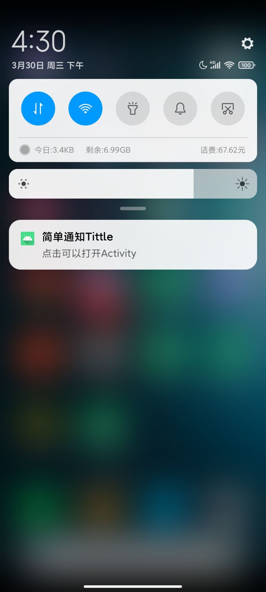

### 前言

> Service作为Android四大组件之一，在每一个应用程序中都扮演着非常重要的角色。它主要用于在后台处理一些耗时的逻辑，或者去执行某些需要长期运行的任务。必要的时候我们甚至可以在程序退出的情况下，让Service在后台继续保持运行状态。

### 一、Service的基本用法

##### 1.1、创建Service

关于Service最基本的用法自然就是如何启动一个Service了，启动Service的方法和启动Activity很类似，都需要借助Intent来实现，下面我们就通过一个具体的例子来看一下。  
然后新建一个MainService继承自Service，并重写父类的onCreate()、onStartCommand()和onDestroy()方法，如下所示：

```java
public class MainService extends Service {

    public static final String TAG = "MainService=========";

    @Override
    public void onCreate() {
        super.onCreate();
        Log.d(TAG, "onCreate() executed");
    }

    @Override
    public int onStartCommand(Intent intent, int flags, int startId) {
        Log.d(TAG, "onStartCommand() executed");
        return super.onStartCommand(intent, flags, startId);
    }


    @Nullable
    @Override
    public IBinder onBind(Intent intent) {
        Log.d(TAG, "onBind() executed");
        return null;
    }

    @Override
    public void onDestroy() {
        Log.d(TAG, "onDestroy() executed");
        super.onDestroy();
    }

}
```

我们只是在onCreate()、onStartCommand()和onDestroy()方法中分别打印了一句话，并没有进行其它任何的操作。

##### 1.2、在Activity中开启Service

```xml
<?xml version="1.0" encoding="utf-8"?>
<LinearLayout xmlns:android="http://schemas.android.com/apk/res/android"
    xmlns:tools="http://schemas.android.com/tools" android:layout_width="match_parent"
    android:layout_height="match_parent" android:orientation="vertical"
    tools:context=".MainActivity">

    <Button android:id="@+id/btn_start_service" android:layout_width="match_parent"
        android:layout_height="wrap_content" android:text="开启服务" />

    <Button android:id="@+id/btn_stop_service" android:layout_width="match_parent"
        android:layout_height="wrap_content" android:text="停止服务" />

</LinearLayout>
```

```java
public class MainActivity extends AppCompatActivity {

    public static final String TAG = "MainActivity=========";

    @Override
    protected void onCreate(Bundle savedInstanceState) {
        super.onCreate(savedInstanceState);
        setContentView(R.layout.activity_main);
        Log.d(TAG, "onCreate() executed");
        findViewById(R.id.btn_start_service).setOnClickListener(v -> {
            Intent intent = new Intent(MainActivity.this, MainService.class);
            startService(intent);
        });
        findViewById(R.id.btn_stop_service).setOnClickListener(v -> {
            Intent intent = new Intent(MainActivity.this, MainService.class);
            stopService(intent);
        });
    }


    @Override
    protected void onDestroy() {
        super.onDestroy();
        Log.d(TAG, "onDestroy() executed");
    }
}
```

##### 1.3、AndroidManifest.xml文件信息：

```xml
<?xml version="1.0" encoding="utf-8"?>
<manifest xmlns:android="http://schemas.android.com/apk/res/android"
    package="com.afs.rethinkingservice01">

    <application android:allowBackup="true" android:icon="@mipmap/ic_launcher"
        android:label="@string/app_name" android:roundIcon="@mipmap/ic_launcher_round"
        android:supportsRtl="true" android:theme="@style/Theme.RethinkingService">
        <activity android:name="com.afs.rethinkingservice01.MainActivity" android:exported="true">
            <intent-filter>
                <action android:name="android.intent.action.MAIN" />

                <category android:name="android.intent.category.LAUNCHER" />
            </intent-filter>
        </activity>
        <service android:name="com.afs.rethinkingservice01.MainService" />
    </application>

</manifest>
```

##### 1.4、点击【开启服务】，日志信息如下

```cmd
2022-03-30 15:04:10.300 20476-20476/com.afs.rethinkingservice01 D/MainActivity=========: onCreate() executed
2022-03-30 15:04:25.536 20476-20476/com.afs.rethinkingservice01 D/MainService=========: onCreate() executed
2022-03-30 15:04:25.537 20476-20476/com.afs.rethinkingservice01 D/MainService=========: onStartCommand() executed
```

也就是说，**当启动一个Service的时候，会调用该Service中的onCreate()和onStartCommand()方法。**

##### 1.5、再次点击开启StartService，日志信息如下

```cmd
2022-03-30 15:04:10.300 20476-20476/com.afs.rethinkingservice01 D/MainActivity=========: onCreate() executed
2022-03-30 15:04:25.536 20476-20476/com.afs.rethinkingservice01 D/MainService=========: onCreate() executed
2022-03-30 15:04:25.537 20476-20476/com.afs.rethinkingservice01 D/MainService=========: onStartCommand() executed
2022-03-30 15:08:31.683 20476-20476/com.afs.rethinkingservice01 D/MainService=========: onStartCommand() executed
```

可以看到，这次只有onStartCommand()方法执行了，onCreate()方法并没有执行，为什么会这样呢？  
这是由于onCreate()方法只会在Service第一次被创建的时候调用，如果当前Service已经被创建过了，  
不管怎样调用startService()方法，onCreate()方法都不会再执行。   
后续再次点击【开启服务】，每次都只会有onStartCommand()方法中的打印日志。

##### 1.6、点击【停止服务】按钮，销毁Service，会触发服务的onDestroy方法

```cmd
2022-03-30 15:04:10.300 20476-20476/com.afs.rethinkingservice01 D/MainActivity=========: onCreate() executed
2022-03-30 15:04:25.536 20476-20476/com.afs.rethinkingservice01 D/MainService=========: onCreate() executed
2022-03-30 15:04:25.537 20476-20476/com.afs.rethinkingservice01 D/MainService=========: onStartCommand() executed
2022-03-30 15:08:31.683 20476-20476/com.afs.rethinkingservice01 D/MainService=========: onStartCommand() executed
2022-03-30 15:13:15.407 20476-20476/com.afs.rethinkingservice01 D/MainService=========: onDestroy() executed
```

### 二、Service和Activity的通讯

接下来我们尝试让Activity和Service建立关联，然后让Activity指定Service去执行一些什么任务。

##### 2.1、首先是MainService的代码，新增一个内部类MainBinder,为其添加一个方法onStartDownload()，并在onBind方法中返回

```java
public class MainService extends Service {

    public static final String TAG = "MainService=========";

    public class MainBinder extends Binder {

        void onStartDownload() {
            Log.d(TAG, "MainBinder startDownload() executed");
        }
    }

    private MainBinder mBinder = new MainBinder();

    @Override
    public void onCreate() {
        super.onCreate();
        Log.d(TAG, "onCreate() executed");
    }

    @Override
    public int onStartCommand(Intent intent, int flags, int startId) {
        Log.d(TAG, "onStartCommand() executed");
        return super.onStartCommand(intent, flags, startId);
    }


    @Nullable
    @Override
    public IBinder onBind(Intent intent) {
        Log.d(TAG, "onBind() executed");
        return mBinder;
    }

    @Override
    public void onDestroy() {
        Log.d(TAG, "onDestroy() executed");
        super.onDestroy();
    }

}
```

##### 2.2、然后是MainActivity的代码，新增一个【绑定服务】按钮；

```xml
<?xml version="1.0" encoding="utf-8"?>
<LinearLayout xmlns:android="http://schemas.android.com/apk/res/android"
    xmlns:tools="http://schemas.android.com/tools" android:layout_width="match_parent"
    android:layout_height="match_parent" android:orientation="vertical"
    tools:context=".MainActivity">

    <Button android:id="@+id/btn_start_service" android:layout_width="match_parent"
        android:layout_height="wrap_content" android:text="开启服务" />

    <Button android:id="@+id/btn_bind_service" android:layout_width="match_parent"
        android:layout_height="wrap_content" android:text="绑定服务" />

    <Button android:id="@+id/btn_stop_service" android:layout_width="match_parent"
        android:layout_height="wrap_content" android:text="停止服务" />


</LinearLayout>
```

```java
public class MainActivity extends AppCompatActivity {

    public static final String TAG = "MainActivity=========";
    private MainService.MainBinder mBinder;

    private ServiceConnection mServiceConnection = new ServiceConnection() {

        @Override
        public void onServiceDisconnected(ComponentName name) {
            Log.d(TAG, "onServiceDisconnected() executed");
        }

        @Override
        public void onServiceConnected(ComponentName name, IBinder service) {
            Log.d(TAG, "onServiceConnected() executed");
            mBinder = (MainService.MainBinder) service;
            mBinder.onStartDownload();//调用该MainBinder的方法
        }
    };

    @Override
    protected void onCreate(Bundle savedInstanceState) {
        super.onCreate(savedInstanceState);
        setContentView(R.layout.activity_main);
        Log.d(TAG, "onCreate() executed");
        findViewById(R.id.btn_start_service).setOnClickListener(v -> {
            Intent intent = new Intent(MainActivity.this, MainService.class);
            startService(intent);
        });
        findViewById(R.id.btn_bind_service).setOnClickListener(v -> {
            Intent intent = new Intent(MainActivity.this, MainService.class);
            bindService(intent, mServiceConnection, BIND_AUTO_CREATE);
        });
        findViewById(R.id.btn_stop_service).setOnClickListener(v -> {
            Intent intent = new Intent(MainActivity.this, MainService.class);
            stopService(intent);
        });
    }

    @Override
    protected void onDestroy() {
        super.onDestroy();
        Log.d(TAG, "onDestroy() executed");
    }
}
```

##### 2.3、点击【绑定服务】按钮，日志信息如下

```cmd
2022-03-30 15:29:52.887 21416-21416/com.afs.rethinkingservice01 D/MainActivity=========: onCreate() executed
2022-03-30 15:29:57.192 21416-21416/com.afs.rethinkingservice01 D/MainService=========: onCreate() executed
2022-03-30 15:29:57.192 21416-21416/com.afs.rethinkingservice01 D/MainService=========: onBind() executed
2022-03-30 15:29:57.196 21416-21416/com.afs.rethinkingservice01 D/MainService=========: onServiceConnected() executed
2022-03-30 15:29:57.196 21416-21416/com.afs.rethinkingservice01 D/MainService=========: MainBinder startDownload() executed
```

从日志信息可以看出，我们成功获取到了MainService中的MainBinder实例，这样我们就可以控制他做我们想做的事情了。

##### 2.3、点击【解绑服务】按钮，日志信息如下

如果我们想要解绑服务，我们只需要调用 unbindService(mServiceConnection)方法即可。

```cmd
2022-03-30 15:46:56.253 22168-22168/com.afs.rethinkingservice01 D/MainActivity=========: onCreate() executed
2022-03-30 15:47:00.766 22168-22168/com.afs.rethinkingservice01 D/MainService=========: onCreate() executed
2022-03-30 15:47:00.767 22168-22168/com.afs.rethinkingservice01 D/MainService=========: onBind() executed
2022-03-30 15:47:00.771 22168-22168/com.afs.rethinkingservice01 D/MainActivity=========: onServiceConnected() executed
2022-03-30 15:47:00.771 22168-22168/com.afs.rethinkingservice01 D/MainService=========: MainBinder startDownload() executed
2022-03-30 15:47:03.416 22168-22168/com.afs.rethinkingservice01 D/MainService=========: onUnbind() executed
2022-03-30 15:47:03.417 22168-22168/com.afs.rethinkingservice01 D/MainService=========: onDestroy() executed
```

### 三、销毁Service

##### 3.1、startService(intent)和stopService(intent)

我们调用startService(intent)和stopService(intent)方法分别实现了Service的启动和销毁；

##### 3.2、bindService(intent, mServiceConnection, BIND_AUTO_CREATE)和 unbindService(mServiceConnection)

由于在绑定Service的时候指定的标志位是BIND_AUTO_CREATE，说明点击Bind Service按钮的时候Service也会被创建，
这时候其实也很简单，点击一下【解绑服务】按钮，将Activity和Service的关联解除，Service就会跟着销毁了

##### 3.3 既点击了startService，又点击了bindService

这个时候你会发现，不管你是单独点击Stop Service按钮还是Unbind Service按钮，Service都不会被销毁，必要将两个按钮都点击一下，Service才会被销毁。  
也就是说，点击Stop Service按钮只会让Service停止，点击Unbind Service按钮只会让Service和Activity解除关联，  
**一个Service必须要在既没有和任何Activity关联又处理停止状态的时候才会被销毁。**

### 四、Service和Thread的关系

##### 4.1 不少Android初学者都可能会有这样的疑惑，Service和Thread到底有什么关系呢？ 什么时候应该用Service，什么时候又应该用Thread？

答案可能会有点让你吃惊，因为Service和Thread之间没有任何关系！ 之所以有不少人会把它们联系起来，主要就是因为Service的后台概念。
Thread我们大家都知道，是用于开启一个子线程，在这里去执行一些耗时操作就不会阻塞主线程的运行。  
而Service我们最初理解的时候，总会觉得它是用来处理一些后台任务的，一些比较耗时的操作也可以放在这里运行，这就会让人产生混淆了。  
但是，如果我告诉你Service其实是运行在主线程里的，你还会觉得它和Thread有什么关系吗？让我们看一下这个残酷的事实吧。

在MainActivity的onCreate()方法里加入一行打印当前线程id的语句：

> Log.d(TAG, "onCreate() executed Thread id is " + Thread.currentThread().getId());

然后在MainService的onCreate()方法里也加入一行打印当前线程id的语句：
> Log.d(TAG, "onCreate() executed Thread id is " + Thread.currentThread().getId());

重新运行，并启动服务，日志信息如下:

```cmd
2022-03-30 15:52:38.392 22399-22399/com.afs.rethinkingservice01 D/MainActivity=========: onCreate() executed
2022-03-30 15:52:38.392 22399-22399/com.afs.rethinkingservice01 D/MainActivity=========: onCreate() executed Thread id is 2
2022-03-30 15:52:42.529 22399-22399/com.afs.rethinkingservice01 D/MainService=========: onCreate() executed
2022-03-30 15:52:42.529 22399-22399/com.afs.rethinkingservice01 D/MainService=========: onCreate() executed Thread id is 2
2022-03-30 15:52:42.529 22399-22399/com.afs.rethinkingservice01 D/MainService=========: onStartCommand() executed
```

可以看到，它们的线程id完全是一样的，由此证实了Service确实是运行在主线程里的，也就是说如果你在Service里编写了非常耗时的代码，程序必定会出现ANR的。

由此可见，我们不应该把后台和子线程联系在一起，这是两个完全不同的概念。
Android的后台就是指，它的运行是完全不依赖UI的。即使Activity被销毁，或者程序被关闭，只要进程还在，Service就可以继续运行。
这样Service就可以帮我们做一些必须要依赖UI的事情。  
比如说一些应用程序，始终需要与服务器之间始终保持着心跳连接，就可以使用Service来实现。  
你可能又会问，前面不是刚刚验证过Service是运行在主线程里的么？  
在这里一直执行着心跳连接，难道就不会阻塞主线程的运行吗？  
当然会，但是我们可以在Service中再创建一个子线程，然后在这里去处理耗时逻辑就没问题了。

##### 4.2 下面是一个比较标准的Service

```java
public class MainService extends Service {

    public static final String TAG = "MainService=========";

    public class MainBinder extends Binder {

        void onStartDownload() {
            Log.d(TAG, "MainBinder startDownload() executed");
            new Thread(new Runnable() {
                @Override
                public void run() {
                    // 执行具体的下载任务
                }
            }).start();
        }
    }

    private MainBinder mBinder = new MainBinder();

    @Override
    public void onCreate() {
        super.onCreate();
        Log.d(TAG, "onCreate() executed");
        Log.d(TAG, "onCreate() executed Thread id is " + Thread.currentThread().getId());
    }

    @Override
    public int onStartCommand(Intent intent, int flags, int startId) {
        Log.d(TAG, "onStartCommand() executed");
        new Thread(new Runnable() {
            @Override
            public void run() {
                // 开始执行后台任务
            }
        }).start();
        return super.onStartCommand(intent, flags, startId);
    }


    @Nullable
    @Override
    public IBinder onBind(Intent intent) {
        Log.d(TAG, "onBind() executed");
        return mBinder;
    }

    @Override
    public boolean onUnbind(Intent intent) {
        Log.d(TAG, "onUnbind() executed");
        return super.onUnbind(intent);
    }

    @Override
    public void onDestroy() {
        Log.d(TAG, "onDestroy() executed");
        super.onDestroy();
    }

}
```

### 五、前台Service

Service几乎都是在后台运行的，一直以来它都是默默地做着辛苦的工作。但是Service的系统优先级还是比较低的，当系统出现内存不足情况时，就有可能会回收掉正在后台运行的Service。  
如果你希望Service可以一直保持运行状态，而不会由于系统内存不足的原因导致被回收，就可以考虑使用前台Service。  
前台Service和普通Service最大的区别就在于，它会一直有一个正在运行的图标在系统的状态栏显示， 下拉状态栏后可以看到更加详细的信息，非常类似于通知的效果。  
当然有时候你也可能不仅仅是为了防止Service被回收才使用前台Service，有些项目由于特殊的需求会要求必须使用前台Service，  
比如说墨迹天气，它的Service在后台更新天气数据的同时，还会在系统状态栏一直显示当前天气的信息。

##### 5.1 创建前台Service

修改MainService的代码，如下所示：

```
public class MainService extends Service {
        .........
    @Override
    public void onCreate() {
        super.onCreate();
        Log.d(TAG, "onCreate() executed");
        Log.d(TAG, "onCreate() executed Thread id is " + Thread.currentThread().getId());
        //NotificationChannel需要做系统版本兼容，这里只考虑SDK28之后的
        if (android.os.Build.VERSION.SDK_INT >= android.os.Build.VERSION_CODES.O) {
            String CHANNEL_ID = "main_channel_01";
            NotificationChannel channel = new NotificationChannel(CHANNEL_ID, "Channel human readable title", NotificationManager.IMPORTANCE_DEFAULT);
            ((NotificationManager) getSystemService(Context.NOTIFICATION_SERVICE)).createNotificationChannel(channel);
            Notification.Builder notification = new Notification.Builder(this, CHANNEL_ID)
                    .setTicker("正在下载")
                    .setSmallIcon(R.mipmap.ic_launcher)
                    .setContentTitle("简单通知Tittle")
                    .setContentText("点击可以打开Activity");
            startForeground(1, notification.build());
        }
    }
        .........
}
```

高版本系统需要在AndroidManifest.xml中配置权限

```xml

<uses-permission android:name="android.permission.FOREGROUND_SERVICE" />
```

在MainService中创建Notification并在通知栏中显示相应的UI。




