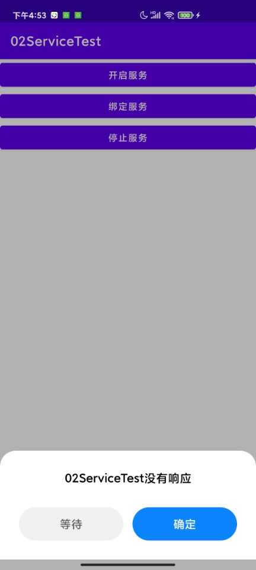
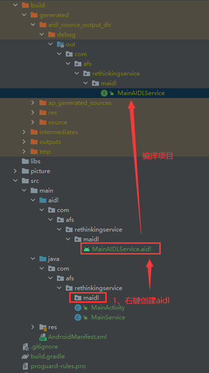
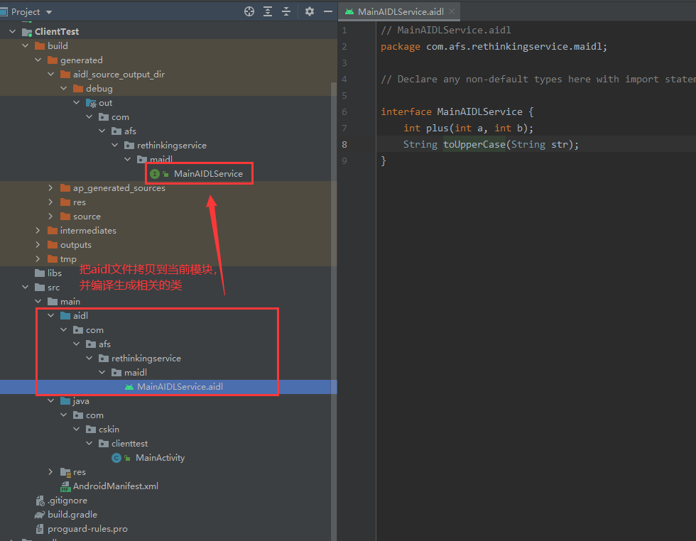

## 前言

> 上一篇我们讲述了Service的基础用法，这次我们要在之前的基础上继续重新认识Service

## 一、Service导致的ANR现象

在上篇文章中我们知道了，Service其实也是运行在主线程里的，如果直接在Service中处理一些耗时的逻辑，就会导致程序ANR。  
如下所示，我们让onStartCommand方法休眠60秒。

```java
public class MainService extends Service {

    public static final String TAG = "MainService=========";

    public class MainBinder extends Binder {

        void onStartDownload() {
            Log.d(TAG, "MainBinder startDownload() executed");
        }
    }

    private MainBinder mBinder = new MainBinder();

    @Override
    public void onCreate() {
        super.onCreate();
        Log.d(TAG, "onCreate() executed");
    }

    @Override
    public int onStartCommand(Intent intent, int flags, int startId) {
        Log.d(TAG, "onStartCommand() executed");
        try {
            Thread.sleep(60 * 1000);//休眠60秒
        } catch (InterruptedException e) {
            e.printStackTrace();
        }
        Log.d(TAG, "onStartCommand_sleep() executed");
        return super.onStartCommand(intent, flags, startId);
    }


    @Nullable
    @Override
    public IBinder onBind(Intent intent) {
        Log.d(TAG, "onBind() executed");
        return mBinder;
    }

    @Override
    public void onDestroy() {
        Log.d(TAG, "onDestroy() executed");
        super.onDestroy();
    }

}
```

当我们点击开启服务或者绑定服务的时候，程序就会阻塞住并无法进行任何其它操作，过一段时间后就会弹出ANR的提示框，如下图所示。


## 二、创建远程Service

由于我们之前所使用的Service其实都是本地服务，本地服务默认也是处于主线程之中， 我们应该在Service中开启线程去执行耗时任务，这样就可以有效地避免ANR的出现

如果我们既不想使用线程，又不想ANR出现，那么我们就可以考虑远程服务了。

### 2.1 创建

要创建一个远程服务，我们只需要在注册Service的时候将它的android:process属性指定成:remote就可以了，代码如下所示：

```xml
<?xml version="1.0" encoding="utf-8"?>
<manifest xmlns:android="http://schemas.android.com/apk/res/android"
    package="com.afs.rethinkingservice">

    <application android:allowBackup="true" android:icon="@mipmap/ic_launcher"
        android:label="@string/app_name" android:roundIcon="@mipmap/ic_launcher_round"
        android:supportsRtl="true" android:theme="@style/Theme.RethinkingService">
        <activity android:name="com.afs.rethinkingservice.MainActivity" android:exported="true">
            <intent-filter>
                <action android:name="android.intent.action.MAIN" />

                <category android:name="android.intent.category.LAUNCHER" />
            </intent-filter>
        </activity>
        <service android:name="com.afs.rethinkingservice.MainService" android:process=":remote" />
    </application>

</manifest>
```

重新运行我们的程序，再次点击开启服务，我们可以主界面没有被卡主，而且也不会出现ANR异常。  
大概过了60秒后，又会看到onStartCommand_sleep() executed打印了出来。（高版本系统可能无法显示）

```cmd
2022-03-30 17:08:29.782 6534-6534/com.afs.rethinkingservice02 D/MainActivity=========: onCreate() executed
2022-03-30 17:08:31.443 6626-6626/com.afs.rethinkingservice02 D/MainService=========: onCreate() executed
2022-03-30 17:08:31.444 6626-6626/com.afs.rethinkingservice02 D/MainService=========: onStartCommand() executed
2022-03-30 17:09:31.444 7680-7680/com.afs.rethinkingservice02 D/MainService=========: onStartCommand_sleep() executed
```

为什么将MyService转换成远程Service后就不会导致程序ANR了呢？  
这是由于，使用了远程Service后，MyService已经在另外一个进程当中运行了，所以只会阻塞该进程中的主线程，并不会影响到当前的应用程序。

我们分别在MainActivity的onCreate()方法和MyService的onCreate()方法里加入一行日志，打印出各自所在的进程id和线程id，如下所示：

```
        Log.d(TAG, "onCreate() executed Thread id is " + Thread.currentThread().getId());
        Log.d(TAG, "onCreate() executed process id is " + Process.myPid());
```

```cmd
2022-03-30 17:15:20.861 7786-7786/com.afs.rethinkingservice02 D/MainActivity=========: onCreate() executed
2022-03-30 17:15:20.861 7786-7786/com.afs.rethinkingservice02 D/MainActivity=========: onCreate() executed Thread id is 2
2022-03-30 17:15:20.862 7786-7786/com.afs.rethinkingservice02 D/MainActivity=========: onCreate() executed process id is 7786
2022-03-30 17:15:32.351 7840-7840/com.afs.rethinkingservice02 D/MainService=========: onCreate() executed
2022-03-30 17:15:32.351 7840-7840/com.afs.rethinkingservice02 D/MainService=========: onCreate() executed Thread id is 2
2022-03-30 17:15:32.351 7840-7840/com.afs.rethinkingservice02 D/MainService=========: onCreate() executed process id is 7840
2022-03-30 17:15:32.352 7840-7840/com.afs.rethinkingservice02 D/MainService=========: onStartCommand() executed
```

我们可以看到线程ID和进程ID都不一样了。

## 三、关联远程Service

既然远程Service这么好用，干脆以后我们把所有的Service都转换成远程Service吧，还省得再开启线程了？  
其实不然，远程Service非但不好用，甚至可以称得上是较为难用。一般情况下如果可以不使用远程Service，就尽量不要使用它。

### 3.1 远程进程存在的问题

修改MainService的代码，去除休眠，如下所示：

```java
public class MainService extends Service {

    public static final String TAG = "MainService=========";

    public class MainBinder extends Binder {

        void onStartDownload() {
            Log.d(TAG, "MainBinder startDownload() executed");
        }
    }

    private MainBinder mBinder = new MainBinder();

    @Override
    public void onCreate() {
        super.onCreate();
        Log.d(TAG, "onCreate() executed");
        Log.d(TAG, "onCreate() executed Thread id is " + Thread.currentThread().getId());
        Log.d(TAG, "onCreate() executed process id is " + Process.myPid());
    }

    @Override
    public int onStartCommand(Intent intent, int flags, int startId) {
        Log.d(TAG, "onStartCommand() executed");
        return super.onStartCommand(intent, flags, startId);
    }


    @Nullable
    @Override
    public IBinder onBind(Intent intent) {
        Log.d(TAG, "onBind() executed");
        return mBinder;
    }

    @Override
    public void onDestroy() {
        Log.d(TAG, "onDestroy() executed");
        super.onDestroy();
    }

}
```

现在重新运行，然后点击开启服务，再点击绑定服务，发现程序直接闪退了，且出现了如下错误日志信息：

```cmd
java.lang.ClassCastException: android.os.BinderProxy cannot be cast to com.afs.rethinkingservice.MainService$MainBinder
```

为什么点击开启服务按钮程序就不会崩溃，而点击Bind Service按钮就会崩溃呢？  
这是由于在BindService按钮的点击事件里面我们会让MainActivity和MyService建立关联，但是目前MyService已经是一个远程Service了，  
Activity和Service运行在两个不同的进程当中，这时就不能再使用传统的建立关联的方式，程序也就崩溃了。

### 3.2 创建AIDL

为了让Activity与一个远程Service建立关联，我们就需要使用AIDL来进行跨进程通信了（IPC）。 AIDL（Android Interface Definition
Language）是Android接口定义语言的意思，它可以用于让某个Service与多个应用程序组件之间进行跨进程通信， 从而可以实现多个应用程序共享同一个Service的功能。

我们创建一个名为MainAIDLService.aidl的文件

```aidl
// MainAIDLService.aidl
package com.afs.rethinkingservice.maidl;

// Declare any non-default types here with import statements

interface MainAIDLService {
    int plus(int a, int b);
	String toUpperCase(String str);
}
```

然后编译，编译器会在build文件夹中自动帮我们创建一些Java类。


### 3.3 使用AIDL相关类

修改MainService中的代码，在里面实现我们刚刚定义好的MyAIDLService接口，如下所示：

```java
public class MainService extends Service {

    public static final String TAG = "MainService=========";

    public class MainBinder extends MainAIDLService.Stub {

        @Override
        public int plus(int a, int b) throws RemoteException {
            return a + b;//获取a和b的和
        }

        @Override
        public String toUpperCase(String str) throws RemoteException {
            return str.toUpperCase();//获取字符串的大写信息
        }
    }

    private MainBinder mBinder = new MainBinder();

    @Override
    public void onCreate() {
        super.onCreate();
        Log.d(TAG, "onCreate() executed");
        Log.d(TAG, "onCreate() executed Thread id is " + Thread.currentThread().getId());
        Log.d(TAG, "onCreate() executed process id is " + Process.myPid());
    }

    @Override
    public int onStartCommand(Intent intent, int flags, int startId) {
        Log.d(TAG, "onStartCommand() executed");
        return super.onStartCommand(intent, flags, startId);
    }


    @Nullable
    @Override
    public IBinder onBind(Intent intent) {
        Log.d(TAG, "onBind() executed");
        return mBinder;
    }

    @Override
    public void onDestroy() {
        Log.d(TAG, "onDestroy() executed");
        super.onDestroy();
    }

}
```

```java
public class MainActivity extends AppCompatActivity {

    public static final String TAG = "MainActivity=========";
    private MainAIDLService mBinder;

    private ServiceConnection mServiceConnection = new ServiceConnection() {

        @Override
        public void onServiceDisconnected(ComponentName name) {
            Log.d(TAG, "onServiceDisconnected() executed");
        }

        @Override
        public void onServiceConnected(ComponentName name, IBinder service) {
            Log.d(TAG, "onServiceConnected() executed");
            mBinder = MainAIDLService.Stub.asInterface(service);
        }
    };

    @Override
    protected void onCreate(Bundle savedInstanceState) {
        super.onCreate(savedInstanceState);
        setContentView(R.layout.activity_main);
        Log.d(TAG, "onCreate() executed");
        Log.d(TAG, "onCreate() executed Thread id is " + Thread.currentThread().getId());
        Log.d(TAG, "onCreate() executed process id is " + Process.myPid());
        findViewById(R.id.btn_start_service).setOnClickListener(v -> {
            Intent intent = new Intent(MainActivity.this, MainService.class);
            startService(intent);
        });
        findViewById(R.id.btn_bind_service).setOnClickListener(v -> {
            Intent intent = new Intent(MainActivity.this, MainService.class);
            bindService(intent, mServiceConnection, BIND_AUTO_CREATE);
        });
        findViewById(R.id.btn_stop_service).setOnClickListener(v -> {
            Intent intent = new Intent(MainActivity.this, MainService.class);
            stopService(intent);
        });
        findViewById(R.id.btn_test_aidl_method).setOnClickListener(v -> {
            try {
                int total = mBinder.plus(1, 1);
                Log.d(TAG, "total === " + total);
                String newString = mBinder.toUpperCase("aaabbbcccddd");
                Log.d(TAG, "newString === " + newString);
            } catch (RemoteException e) {
                e.printStackTrace();
            }
        });
    }

    @Override
    protected void onDestroy() {
        super.onDestroy();
        Log.d(TAG, "onDestroy() executed");
    }
}
```

点击绑定服务按钮，然后点击测试AIDL中的方法，日志信息如下所示；

```cmd
2022-03-30 17:45:41.959 9580-9580/com.afs.rethinkingservice02 D/MainActivity=========: onServiceConnected() executed
2022-03-30 17:45:44.608 9580-9580/com.afs.rethinkingservice02 D/MainActivity=========: total === 2
2022-03-30 17:45:44.609 9580-9580/com.afs.rethinkingservice02 D/MainActivity=========: newString === AAABBBCCCDDD
```

由此可见，我们确实已经成功实现跨进程通信了，在一个进程中访问到了另外一个进程中的方法。

## 四、跨应用访问Service

我们目前的跨进程通信实际上并没有什么实质上的作用，因为这只是在一个Activity里调用了同一个应用程序的Service里的方法。  
而跨进程通信的真正意义是为了让一个应用程序去访问另一个应用程序中的Service，以实现共享Service的功能。
那么下面我们自然要尝试一下，如何才能在其它的应用程序中调用到MainService里的方法。

### 4.1 普通的关联

之前我们让Activity与Service之间建立关联，都是调用bindService()方法，并将Intent作为参数传递进去，在Intent里指定好要绑定的Service：

```cmd
       Intent intent = new Intent(MainActivity.this, MainService.class);
       bindService(intent, mServiceConnection, BIND_AUTO_CREATE);
```

### 4.1 隐式关联

这里在构建Intent的时候是使用MainService.class来指定要绑定哪一个Service的，但是在另一个应用程序中去绑定Service的时候并没有MyService这个类，这时就必须使用到隐式Intent了。  
现在修改AndroidManifest.xml中的代码，给MainService加上一个action：

```xml

<service android:name="com.afs.rethinkingservice.MainService" android:exported="true"
    android:process=":remote">
    <intent-filter>
        <action android:name="com.afs.rethinkingservice.maidl.MainAIDLService" />
    </intent-filter>
</service>
```

这就说明，MainService可以响应带有com.afs.rethinkingservice.maidl.MainAIDLService这个action的Intent。
现在重新运行一下程序，这样就把远程Service端的工作全部完成了。

### 4.2 创建客户端app

创建一个新的Android模块，起名为ClientTest，我们就尝试在这个程序中远程调用MainService中的方法。

```xml
<?xml version="1.0" encoding="utf-8"?>
<LinearLayout xmlns:android="http://schemas.android.com/apk/res/android"
    xmlns:tools="http://schemas.android.com/tools" android:layout_width="match_parent"
    android:layout_height="match_parent" android:orientation="vertical"
    tools:context=".MainActivity">

    <Button android:id="@+id/btn_start_service" android:layout_width="match_parent"
        android:layout_height="wrap_content" android:text="启动服务" />

    <Button android:id="@+id/btn_bind_service" android:layout_width="match_parent"
        android:layout_height="wrap_content" android:text="绑定服务" />

    <Button android:id="@+id/btn_test_aidl_method" android:layout_width="match_parent"
        android:layout_height="wrap_content" android:text="测试AIDL中的方法" />

</LinearLayout>
```

```java
public class MainActivity extends AppCompatActivity {

    @Override
    protected void onCreate(Bundle savedInstanceState) {
        super.onCreate(savedInstanceState);
        setContentView(R.layout.activity_main);
        findViewById(R.id.btn_start_service).setOnClickListener(v -> {

        });
        findViewById(R.id.btn_bind_service).setOnClickListener(v -> {

        });
        findViewById(R.id.btn_test_aidl_method).setOnClickListener(v -> {

        });
    }
}
```

在模块创建完毕之后，把我们之前创建的MainAIDLService.aidl文件整个复制到当前模块中，并保持包名路径不变。 编译生成相关的类。


修改MainActivity中的代码：

```java
public class MainActivity extends AppCompatActivity {

    public static final String TAG = "Client_Main=========";

    private MainAIDLService mBinder;

    private ServiceConnection mServiceConnection = new ServiceConnection() {

        @Override
        public void onServiceDisconnected(ComponentName name) {
            Log.d(TAG, "onServiceDisconnected() executed");
        }

        @Override
        public void onServiceConnected(ComponentName name, IBinder service) {
            Log.d(TAG, "onServiceConnected() executed");
            mBinder = MainAIDLService.Stub.asInterface(service);
        }
    };

    @Override
    protected void onCreate(Bundle savedInstanceState) {
        super.onCreate(savedInstanceState);
        setContentView(R.layout.activity_main);
        findViewById(R.id.btn_start_service).setOnClickListener(v -> {
            Log.d(TAG, "btn_start_service click");
            Intent intent = new Intent("com.afs.rethinkingservice.maidl.MainAIDLService");
            intent.setPackage("com.afs.rethinkingservice02");
            startService(intent);
        });
        findViewById(R.id.btn_bind_service).setOnClickListener(v -> {
            Log.d(TAG, "btn_bind_service click");
            Intent intent = new Intent("com.afs.rethinkingservice.maidl.MainAIDLService");
            intent.setPackage("com.afs.rethinkingservice02");
            bindService(intent, mServiceConnection, BIND_AUTO_CREATE);
        });
        findViewById(R.id.btn_test_aidl_method).setOnClickListener(v -> {
            try {
                Log.d(TAG, "btn_test_aidl_method click");
                int total = mBinder.plus(1, 1);
                Log.d(TAG, "total === " + total);
                String newString = mBinder.toUpperCase("aaabbbcccddd");
                Log.d(TAG, "newString === " + newString);
            } catch (RemoteException e) {
                e.printStackTrace();
            }
        });
    }
}
```

我们首先启动之前我们服务所在的应用，然后再启动ClientTest对应的app，点击绑定服务按钮，然后点击【测试AIDL中的方法】按钮，日志信息如下：

```cmd
2022-03-30 18:30:31.331 12437-12437/com.afs.rethinkingservice02 D/MainActivity=========: onCreate() executed
2022-03-30 18:30:31.331 12437-12437/com.afs.rethinkingservice02 D/MainActivity=========: onCreate() executed Thread id is 2
2022-03-30 18:30:31.331 12437-12437/com.afs.rethinkingservice02 D/MainActivity=========: onCreate() executed process id is 12437
2022-03-30 18:30:48.179 12559-12559/com.afs.clienttest D/Client_Main=========: btn_bind_service click
2022-03-30 18:30:48.436 12608-12608/com.afs.rethinkingservice02 D/MainService=========: onCreate() executed
2022-03-30 18:30:48.436 12608-12608/com.afs.rethinkingservice02 D/MainService=========: onCreate() executed Thread id is 2
2022-03-30 18:30:48.436 12608-12608/com.afs.rethinkingservice02 D/MainService=========: onCreate() executed process id is 12608
2022-03-30 18:30:48.437 12608-12608/com.afs.rethinkingservice02 D/MainService=========: onBind() executed
2022-03-30 18:30:48.439 12559-12559/com.afs.clienttest D/Client_Main=========: onServiceConnected() executed
2022-03-30 18:30:51.251 12559-12559/com.afs.clienttest D/Client_Main=========: btn_test_aidl_method click
2022-03-30 18:30:51.251 12559-12559/com.afs.clienttest D/Client_Main=========: total === 2
2022-03-30 18:30:51.252 12559-12559/com.afs.clienttest D/Client_Main=========: newString === AAABBBCCCDDD
```

至此，我们的跨进程通信功能已经成功实现了。
不过还有一点需要说明的是，由于这是在不同的进程之间传递数据，Android对这类数据的格式支持是非常有限的，基本上只能传递Java的基本数据类型、字符串、List或Map等。  
那么如果我想传递一个自定义的类该怎么办呢？这就必须要让这个类去实现Parcelable接口，并且要给这个类也定义一个同名的AIDL文件。  
这部分内容并不复杂，而且和Service关系不大，所以就不再详细进行讲解了，感兴趣的朋友可以自己去查阅一下相关的资料。