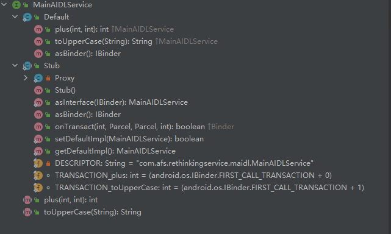
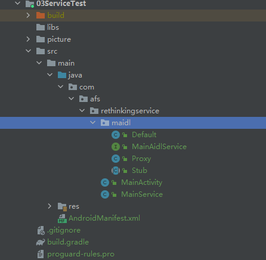

## 前言

> 上一篇我们讲述了Service的进阶用法，特别是在使用跨进程Service的时候，我们使用了AIDL技术，本篇我们具体来理一理所谓的AIDL技术，它到底帮我们做了什么事情。

## 一、AIDL生成了什么文件

### 1.1 新建模块代码

我们新建一个MainActivity和MainService，具体代码如下所示：

```xml
<?xml version="1.0" encoding="utf-8"?>
<manifest xmlns:android="http://schemas.android.com/apk/res/android"
    package="com.afs.rethinkingservice">

    <application android:allowBackup="true" android:icon="@mipmap/ic_launcher"
        android:label="@string/app_name" android:roundIcon="@mipmap/ic_launcher_round"
        android:supportsRtl="true" android:theme="@style/Theme.RethinkingService">
        <activity android:name="com.afs.rethinkingservice.MainActivity" android:exported="true">
            <intent-filter>
                <action android:name="android.intent.action.MAIN" />

                <category android:name="android.intent.category.LAUNCHER" />
            </intent-filter>
        </activity>
        <service android:name="com.afs.rethinkingservice.MainService" android:exported="true"
            android:process=":remote">
            <intent-filter>
                <action android:name="com.afs.rethinkingservice.maidl.MainAIDLService" />
            </intent-filter>
        </service>
    </application>

</manifest>
```

```xml
<?xml version="1.0" encoding="utf-8"?>
<LinearLayout xmlns:android="http://schemas.android.com/apk/res/android"
    xmlns:tools="http://schemas.android.com/tools" android:layout_width="match_parent"
    android:layout_height="match_parent" android:orientation="vertical"
    tools:context=".MainActivity">

    <Button android:id="@+id/btn_start_service" android:layout_width="match_parent"
        android:layout_height="wrap_content" android:text="开启服务" />

    <Button android:id="@+id/btn_bind_service" android:layout_width="match_parent"
        android:layout_height="wrap_content" android:text="绑定服务" />

    <Button android:id="@+id/btn_test_aidl_method" android:layout_width="match_parent"
        android:layout_height="wrap_content" android:text="测试AIDL中的方法" />

    <Button android:id="@+id/btn_stop_service" android:layout_width="match_parent"
        android:layout_height="wrap_content" android:text="停止服务" />


</LinearLayout>
```

```java
public class MainActivity extends AppCompatActivity {

    public static final String TAG = "MainActivity=========";

    private ServiceConnection mServiceConnection = new ServiceConnection() {

        @Override
        public void onServiceDisconnected(ComponentName name) {
            Log.d(TAG, "onServiceDisconnected() executed");
        }

        @Override
        public void onServiceConnected(ComponentName name, IBinder service) {
            Log.d(TAG, "onServiceConnected() executed");
        }
    };

    @Override
    protected void onCreate(Bundle savedInstanceState) {
        super.onCreate(savedInstanceState);
        setContentView(R.layout.activity_main);
        Log.d(TAG, "onCreate() executed");
        Log.d(TAG, "onCreate() executed Thread id is " + Thread.currentThread().getId());
        Log.d(TAG, "onCreate() executed process id is " + Process.myPid());
        findViewById(R.id.btn_start_service).setOnClickListener(v -> {
            Intent intent = new Intent(MainActivity.this, MainService.class);
            startService(intent);
        });
        findViewById(R.id.btn_bind_service).setOnClickListener(v -> {
            Intent intent = new Intent(MainActivity.this, MainService.class);
            bindService(intent, mServiceConnection, BIND_AUTO_CREATE);
        });
        findViewById(R.id.btn_stop_service).setOnClickListener(v -> {
            Intent intent = new Intent(MainActivity.this, MainService.class);
            stopService(intent);
        });
        findViewById(R.id.btn_test_aidl_method).setOnClickListener(v -> {

        });
    }

    @Override
    protected void onDestroy() {
        super.onDestroy();
        Log.d(TAG, "onDestroy() executed");
    }
}
```

```java
package com.afs.rethinkingservice;

import android.app.Service;
import android.content.Intent;
import android.os.IBinder;
import android.os.Process;
import android.util.Log;

import androidx.annotation.Nullable;

public class MainService extends Service {

    public static final String TAG = "MainService=========";


    @Override
    public void onCreate() {
        super.onCreate();
        Log.d(TAG, "onCreate() executed");
        Log.d(TAG, "onCreate() executed Thread id is " + Thread.currentThread().getId());
        Log.d(TAG, "onCreate() executed process id is " + Process.myPid());
    }

    @Override
    public int onStartCommand(Intent intent, int flags, int startId) {
        Log.d(TAG, "onStartCommand() executed");
        return super.onStartCommand(intent, flags, startId);
    }


    @Nullable
    @Override
    public IBinder onBind(Intent intent) {
        Log.d(TAG, "onBind() executed");
        return null;
    }

    @Override
    public void onDestroy() {
        Log.d(TAG, "onDestroy() executed");
        super.onDestroy();
    }

}
```

### 1.2 新建aidl文件

右键新建一个名为MainAIDLService.aidl的文件

```java
package com.afs.rethinkingservice.maidl;

// Declare any non-default types here with import statements

interface MainAIDLService {
    int plus(int a, int b);

    String toUpperCase(String str);
}
```

然后编译该文件，会在build/generated/aidl_source_output_dir目录下生成一个同名的MainAIDLService.java文件。

```java
/*
 * This file is auto-generated.  DO NOT MODIFY.
 */
package com.afs.rethinkingservice.maidl;
// Declare any non-default types here with import statements

public interface MainAIDLService extends android.os.IInterface {
    /** Default implementation for MainAIDLService. */
    public static class Default implements com.afs.rethinkingservice.maidl.MainAIDLService {
        @Override
        public int plus(int a, int b) throws android.os.RemoteException {
            return 0;
        }

        @Override
        public java.lang.String toUpperCase(java.lang.String str) throws android.os.RemoteException {
            return null;
        }

        @Override
        public android.os.IBinder asBinder() {
            return null;
        }
    }

    /** Local-side IPC implementation stub class. */
    public static abstract class Stub extends android.os.Binder implements com.afs.rethinkingservice.maidl.MainAIDLService {
        private static final java.lang.String DESCRIPTOR = "com.afs.rethinkingservice.maidl.MainAIDLService";

        /** Construct the stub at attach it to the interface. */
        public Stub() {
            this.attachInterface(this, DESCRIPTOR);
        }

        /**
         * Cast an IBinder object into an com.afs.rethinkingservice.maidl.MainAIDLService interface,
         * generating a buyFoodProxy if needed.
         */
        public static com.afs.rethinkingservice.maidl.MainAIDLService asInterface(android.os.IBinder obj) {
            if ((obj == null)) {
                return null;
            }
            android.os.IInterface iin = obj.queryLocalInterface(DESCRIPTOR);
            if (((iin != null) && (iin instanceof com.afs.rethinkingservice.maidl.MainAIDLService))) {
                return ((com.afs.rethinkingservice.maidl.MainAIDLService) iin);
            }
            return new com.afs.rethinkingservice.maidl.MainAIDLService.Stub.Proxy(obj);
        }

        @Override
        public android.os.IBinder asBinder() {
            return this;
        }

        @Override
        public boolean onTransact(int code, android.os.Parcel data, android.os.Parcel reply, int flags) throws android.os.RemoteException {
            java.lang.String descriptor = DESCRIPTOR;
            switch (code) {
                case INTERFACE_TRANSACTION: {
                    reply.writeString(descriptor);
                    return true;
                }
                case TRANSACTION_plus: {
                    data.enforceInterface(descriptor);
                    int _arg0;
                    _arg0 = data.readInt();
                    int _arg1;
                    _arg1 = data.readInt();
                    int _result = this.plus(_arg0, _arg1);
                    reply.writeNoException();
                    reply.writeInt(_result);
                    return true;
                }
                case TRANSACTION_toUpperCase: {
                    data.enforceInterface(descriptor);
                    java.lang.String _arg0;
                    _arg0 = data.readString();
                    java.lang.String _result = this.toUpperCase(_arg0);
                    reply.writeNoException();
                    reply.writeString(_result);
                    return true;
                }
                default: {
                    return super.onTransact(code, data, reply, flags);
                }
            }
        }

        private static class Proxy implements com.afs.rethinkingservice.maidl.MainAIDLService {
            private android.os.IBinder mRemote;

            Proxy(android.os.IBinder remote) {
                mRemote = remote;
            }

            @Override
            public android.os.IBinder asBinder() {
                return mRemote;
            }

            public java.lang.String getInterfaceDescriptor() {
                return DESCRIPTOR;
            }

            @Override
            public int plus(int a, int b) throws android.os.RemoteException {
                android.os.Parcel _data = android.os.Parcel.obtain();
                android.os.Parcel _reply = android.os.Parcel.obtain();
                int _result;
                try {
                    _data.writeInterfaceToken(DESCRIPTOR);
                    _data.writeInt(a);
                    _data.writeInt(b);
                    boolean _status = mRemote.transact(Stub.TRANSACTION_plus, _data, _reply, 0);
                    if (!_status && getDefaultImpl() != null) {
                        return getDefaultImpl().plus(a, b);
                    }
                    _reply.readException();
                    _result = _reply.readInt();
                } finally {
                    _reply.recycle();
                    _data.recycle();
                }
                return _result;
            }

            @Override
            public java.lang.String toUpperCase(java.lang.String str) throws android.os.RemoteException {
                android.os.Parcel _data = android.os.Parcel.obtain();
                android.os.Parcel _reply = android.os.Parcel.obtain();
                java.lang.String _result;
                try {
                    _data.writeInterfaceToken(DESCRIPTOR);
                    _data.writeString(str);
                    boolean _status = mRemote.transact(Stub.TRANSACTION_toUpperCase, _data, _reply, 0);
                    if (!_status && getDefaultImpl() != null) {
                        return getDefaultImpl().toUpperCase(str);
                    }
                    _reply.readException();
                    _result = _reply.readString();
                } finally {
                    _reply.recycle();
                    _data.recycle();
                }
                return _result;
            }

            public static com.afs.rethinkingservice.maidl.MainAIDLService sDefaultImpl;
        }

        static final int TRANSACTION_plus = (android.os.IBinder.FIRST_CALL_TRANSACTION + 0);
        static final int TRANSACTION_toUpperCase = (android.os.IBinder.FIRST_CALL_TRANSACTION + 1);

        public static boolean setDefaultImpl(com.afs.rethinkingservice.maidl.MainAIDLService impl) {
            // Only one user of this interface can use this function
            // at a time. This is a heuristic to detect if two different
            // users in the same process use this function.
            if (Stub.Proxy.sDefaultImpl != null) {
                throw new IllegalStateException("setDefaultImpl() called twice");
            }
            if (impl != null) {
                Stub.Proxy.sDefaultImpl = impl;
                return true;
            }
            return false;
        }

        public static com.afs.rethinkingservice.maidl.MainAIDLService getDefaultImpl() {
            return Stub.Proxy.sDefaultImpl;
        }
    }

    public int plus(int a, int b) throws android.os.RemoteException;

    public java.lang.String toUpperCase(java.lang.String str) throws android.os.RemoteException;
}

```

### 1.3 梳理aidl生成的文件内容

对着MainAIDLService.java文件，乍一看我们可能会觉得一脸懵逼，该文件好像非常混乱，但是如果仔细梳理一下，其实会发现里面的结构是这样的



主要是自动生成了四个类，MainAIDLService、Default、Stub、Proxy，如果我们把代码精简一下，大概是下面这样的：

```java
public interface MainAidlService extends android.os.IInterface {
    /**
     * MainAidlService接口的默认实现类（高版本SDK才会生成）
     */
    public static class Default implements com.afs.rethinkingservice.maidl.MainAidlService {

    }

    /**
     * 本地IPC通信的实现类父类
     */
    public static abstract class Stub extends android.os.Binder implements com.afs.rethinkingservice.maidl.MainAidlService {

        /**
         * 远程IPC通讯的实现类
         */
        private static class Proxy implements com.afs.rethinkingservice.maidl.MainAidlService {

        }

    }

}
```

由此可见，aidl主要是帮我们生成了以下四个东西

- 【MainAidlService】接口，继承了android.os.IInterface的接口
- 【Default】类，实现了MainAidlService接口的类（高版本SDK才会生成MainAidlService接口的默认实现类）
- 【Stub】抽象类，继承自android.os.Binder并实现了MainAidlService接口（本地IPC通信的实现类父类）
- 【Proxy】类，实现了MainAidlService接口（远程IPC通讯的实现类）

## 二、去除AIDL文件，创建Java类实现Binder通信

### 2.1 拷贝aidl生成的类

在理清了这四个类之后，接下来我们可以把上面提到的四个类全部拷贝出来，放到我们的java包中，


删除原来右键新建的MainAIDLService.aidl文件，以及在build文件夹中生成的文件。  
之后修复代码(主要是访问权限的修改)，去除错误提示之后，各个类的代码如下所示：

```java
public interface MainAidlService extends android.os.IInterface {

    public int plus(int a, int b) throws android.os.RemoteException;

    public java.lang.String toUpperCase(java.lang.String str) throws android.os.RemoteException;
}

```

```java
public class Default implements com.afs.rethinkingservice.maidl.MainAidlService {
    @Override
    public int plus(int a, int b) throws android.os.RemoteException {
        return 0;
    }

    @Override
    public java.lang.String toUpperCase(java.lang.String str) throws android.os.RemoteException {
        return null;
    }

    @Override
    public android.os.IBinder asBinder() {
        return null;
    }
}
```

```java
public class Proxy implements com.afs.rethinkingservice.maidl.MainAidlService {
    private android.os.IBinder mRemote;

    Proxy(android.os.IBinder remote) {
        mRemote = remote;
    }

    @Override
    public android.os.IBinder asBinder() {
        return mRemote;
    }

    public java.lang.String getInterfaceDescriptor() {
        return DESCRIPTOR;
    }

    @Override
    public int plus(int a, int b) throws android.os.RemoteException {
        android.os.Parcel _data = android.os.Parcel.obtain();
        android.os.Parcel _reply = android.os.Parcel.obtain();
        int _result;
        try {
            _data.writeInterfaceToken(DESCRIPTOR);
            _data.writeInt(a);
            _data.writeInt(b);
            boolean _status = mRemote.transact(Stub.TRANSACTION_plus, _data, _reply, 0);
            if (!_status && getDefaultImpl() != null) {
                return getDefaultImpl().plus(a, b);
            }
            _reply.readException();
            _result = _reply.readInt();
        } finally {
            _reply.recycle();
            _data.recycle();
        }
        return _result;
    }

    @Override
    public java.lang.String toUpperCase(java.lang.String str) throws android.os.RemoteException {
        android.os.Parcel _data = android.os.Parcel.obtain();
        android.os.Parcel _reply = android.os.Parcel.obtain();
        java.lang.String _result;
        try {
            _data.writeInterfaceToken(DESCRIPTOR);
            _data.writeString(str);
            boolean _status = mRemote.transact(Stub.TRANSACTION_toUpperCase, _data, _reply, 0);
            if (!_status && getDefaultImpl() != null) {
                return getDefaultImpl().toUpperCase(str);
            }
            _reply.readException();
            _result = _reply.readString();
        } finally {
            _reply.recycle();
            _data.recycle();
        }
        return _result;
    }

    public static MainAidlService sDefaultImpl;
}
```

```java
public abstract class Stub extends android.os.Binder implements com.afs.rethinkingservice.maidl.MainAidlService {
    public static final java.lang.String DESCRIPTOR = "com.afs.rethinkingservice.maidl.MainAidlService";

    /**
     * Construct the stub at attach it to the interface.
     */
    public Stub() {
        this.attachInterface(this, DESCRIPTOR);
    }

    /**
     * Cast an IBinder object into an com.afs.rethinkingservice.maidl.MainAidlService interface,
     * generating a buyFoodProxy if needed.
     */
    public static com.afs.rethinkingservice.maidl.MainAidlService asInterface(android.os.IBinder obj) {
        if ((obj == null)) {
            return null;
        }
        android.os.IInterface iin = obj.queryLocalInterface(DESCRIPTOR);
        if (((iin != null) && (iin instanceof com.afs.rethinkingservice.maidl.MainAidlService))) {
            return ((com.afs.rethinkingservice.maidl.MainAidlService) iin);
        }
        return new Proxy(obj);
    }

    @Override
    public android.os.IBinder asBinder() {
        return this;
    }

    @Override
    public boolean onTransact(int code, android.os.Parcel data, android.os.Parcel reply, int flags) throws android.os.RemoteException {
        java.lang.String descriptor = DESCRIPTOR;
        switch (code) {
            case INTERFACE_TRANSACTION: {
                reply.writeString(descriptor);
                return true;
            }
            case TRANSACTION_plus: {
                data.enforceInterface(descriptor);
                int _arg0;
                _arg0 = data.readInt();
                int _arg1;
                _arg1 = data.readInt();
                int _result = this.plus(_arg0, _arg1);
                reply.writeNoException();
                reply.writeInt(_result);
                return true;
            }
            case TRANSACTION_toUpperCase: {
                data.enforceInterface(descriptor);
                java.lang.String _arg0;
                _arg0 = data.readString();
                java.lang.String _result = this.toUpperCase(_arg0);
                reply.writeNoException();
                reply.writeString(_result);
                return true;
            }
            default: {
                return super.onTransact(code, data, reply, flags);
            }
        }
    }


    static final int TRANSACTION_plus = (android.os.IBinder.FIRST_CALL_TRANSACTION + 0);
    static final int TRANSACTION_toUpperCase = (android.os.IBinder.FIRST_CALL_TRANSACTION + 1);

    public static boolean setDefaultImpl(com.afs.rethinkingservice.maidl.MainAidlService impl) {
        // Only one user of this interface can use this function
        // at a time. This is a heuristic to detect if two different
        // users in the same process use this function.
        if (Proxy.sDefaultImpl != null) {
            throw new IllegalStateException("setDefaultImpl() called twice");
        }
        if (impl != null) {
            Proxy.sDefaultImpl = impl;
            return true;
        }
        return false;
    }

    public static MainAidlService getDefaultImpl() {
        return Proxy.sDefaultImpl;
    }
}

```

### 2.2 使用我们拷贝的类来实现Binder通信

按照我们之前生成binder对象实例的方式，重新修改我们的MainActivity和MainService的代码，代码如下所示：

```java
public class MainActivity extends AppCompatActivity {

    private MainAidlService mBinder;
    private ServiceConnection mServiceConnection = new ServiceConnection() {

        @Override
        public void onServiceDisconnected(ComponentName name) {
            Log.d(TAG, "onServiceDisconnected() executed");
        }

        @Override
        public void onServiceConnected(ComponentName name, IBinder service) {
            Log.d(TAG, "onServiceConnected() executed");
            mBinder = Stub.asInterface(service);
        }
    };

    @Override
    protected void onCreate(Bundle savedInstanceState) {
        super.onCreate(savedInstanceState);
        setContentView(R.layout.activity_main);
        findViewById(R.id.btn_test_aidl_method).setOnClickListener(v -> {
            try {
                int total = mBinder.plus(1, 1);
                Log.d(TAG, "total === " + total);
                String newString = mBinder.toUpperCase("aaabbbcccddd");
                Log.d(TAG, "newString === " + newString);
            } catch (RemoteException e) {
                e.printStackTrace();
            }
        });
    }

}
```

```java
public class MainService extends Service {

    public class MainBinder extends Stub {

        @Override
        public int plus(int a, int b) throws RemoteException {
            return a + b;
        }

        @Override
        public String toUpperCase(String str) throws RemoteException {
            return str.toUpperCase();
        }
    }

    @Nullable
    @Override
    public IBinder onBind(Intent intent) {
        Log.d(TAG, "onBind() executed");
        return new MainBinder();
    }

}
```

### 2.3 验证结果通讯结果

我们启动app，然后分别点击绑定服务，测试AIDL中的方法按钮，日志信息如下：

```cmd
2022-03-31 15:46:16.793 32638-32638/com.afs.rethinkingservice03 D/MainActivity=========: onCreate() executed
2022-03-31 15:46:16.794 32638-32638/com.afs.rethinkingservice03 D/MainActivity=========: onCreate() executed Thread id is 2
2022-03-31 15:46:16.794 32638-32638/com.afs.rethinkingservice03 D/MainActivity=========: onCreate() executed process id is 32638
2022-03-31 15:46:29.837 739-739/com.afs.rethinkingservice03 D/MainService=========: onCreate() executed
2022-03-31 15:46:29.838 739-739/com.afs.rethinkingservice03 D/MainService=========: onCreate() executed Thread id is 2
2022-03-31 15:46:29.838 739-739/com.afs.rethinkingservice03 D/MainService=========: onCreate() executed process id is 739
2022-03-31 15:46:29.838 739-739/com.afs.rethinkingservice03 D/MainService=========: onBind() executed
2022-03-31 15:46:29.843 32638-32638/com.afs.rethinkingservice03 D/MainActivity=========: onServiceConnected() executed
2022-03-31 15:46:44.757 32638-32638/com.afs.rethinkingservice03 D/MainActivity=========: total === 2
2022-03-31 15:46:44.758 32638-32638/com.afs.rethinkingservice03 D/MainActivity=========: newString === AAABBBCCCDDD
```

根据日志信息可知，我们成功实现了Binder通信。  
这就说明，AIDL技术只是按照某种规范，自动帮我们生成了一些类来帮我们完成Binder通信，  
那么如果我们不用AIDL技术，能否手动创建相关的类来帮我们实现Binder通信呢？
答案当然是可以的，我们完全可以手动创建相关的类来实现Binder通信，只不过相比较而言，aidl自动生成这种方式更简单高效。

## 三、AIDL生成的几个类的作用是什么？

我们已经实现了Binder通信，接下来我们继续来看看这四个类的作用分别是什么。

MainActivity中的代码告诉我们，我们在和MainService进行通信的时候，主要是调用了mBinder方法来实现的:

```c
         mBinder.plus(1, 1);
         mBinder.toUpperCase("aaabbbcccddd");
```

而Bindder主要是通过Stub.asInterface(service)来赋值的：

```c
    private MainAidlService mBinder;
    private ServiceConnection mServiceConnection = new ServiceConnection() {
    
    @Override
    public void onServiceDisconnected(ComponentName name) {
                Log.d(TAG, "onServiceDisconnected() executed");
            }
    
    @Override
    public void onServiceConnected(ComponentName name, IBinder service) {
                Log.d(TAG, "onServiceConnected() executed");
                mBinder = Stub.asInterface(service);
            }
            };
```

那么我们就来看看Stub.asInterface到底做了什么事情：

```java

public abstract class Stub extends android.os.Binder implements com.afs.rethinkingservice.maidl.MainAidlService {
    public static final java.lang.String DESCRIPTOR = "com.afs.rethinkingservice.maidl.MainAidlService";//**关键点2**

    /**
     * Construct the stub at attach it to the interface.
     */
    public Stub() {
        this.attachInterface(this, DESCRIPTOR);//**关键点4**
    }

    /**
     * Cast an IBinder object into an com.afs.rethinkingservice.maidl.MainAidlService interface,
     * generating a buyFoodProxy if needed.
     */
    public static com.afs.rethinkingservice.maidl.MainAidlService asInterface(android.os.IBinder obj) {
        if ((obj == null)) {
            return null;
        }
        android.os.IInterface iin = obj.queryLocalInterface(DESCRIPTOR);//**关键点1**
        if (((iin != null) && (iin instanceof com.afs.rethinkingservice.maidl.MainAidlService))) {//**关键点5**
            return ((com.afs.rethinkingservice.maidl.MainAidlService) iin);
        }
        return new Proxy(obj);//**关键点6**
    }

    @Override
    public boolean onTransact(int code, android.os.Parcel data, android.os.Parcel reply, int flags) throws android.os.RemoteException {
        java.lang.String descriptor = DESCRIPTOR;
        switch (code) {
            case INTERFACE_TRANSACTION: {
                reply.writeString(descriptor);
                return true;
            }
            case TRANSACTION_plus: {
                data.enforceInterface(descriptor);
                int _arg0;
                _arg0 = data.readInt();
                int _arg1;
                _arg1 = data.readInt();
                int _result = this.plus(_arg0, _arg1);//关键点10
                reply.writeNoException();
                reply.writeInt(_result);
                return true;
            }
            case TRANSACTION_toUpperCase: {
                data.enforceInterface(descriptor);
                java.lang.String _arg0;
                _arg0 = data.readString();
                java.lang.String _result = this.toUpperCase(_arg0);//关键点10
                reply.writeNoException();
                reply.writeString(_result);
                return true;
            }
            default: {
                return super.onTransact(code, data, reply, flags);
            }
        }
    }


}
```

```java
public class Binder implements IBinder {

    //**关键点4**
    public void attachInterface(@Nullable IInterface owner, @Nullable String descriptor) {
        mOwner = owner;
        mDescriptor = descriptor;
    }

    //**关键点3**
    public @Nullable
    IInterface queryLocalInterface(@NonNull String descriptor) {
        if (mDescriptor != null && mDescriptor.equals(descriptor)) {
            return mOwner;
        }
        return null;
    }

    //**关键点9**
    public final boolean transact(int code, @NonNull Parcel data, @Nullable Parcel reply,
                                  int flags) throws RemoteException {
        if (false) Log.v("Binder", "Transact: " + code + " to " + this);

        if (data != null) {
            data.setDataPosition(0);
        }
        boolean r = onTransact(code, data, reply, flags);
        if (reply != null) {
            reply.setDataPosition(0);
        }
        return r;
    }
}
```

```java
public class Proxy implements com.afs.rethinkingservice.maidl.MainAidlService {
    private android.os.IBinder mRemote;

    Proxy(android.os.IBinder remote) {//**关键点7**
        mRemote = remote;
    }

    @Override
    public int plus(int a, int b) throws android.os.RemoteException {
        android.os.Parcel _data = android.os.Parcel.obtain();
        android.os.Parcel _reply = android.os.Parcel.obtain();
        int _result;
        try {
            _data.writeInterfaceToken(DESCRIPTOR);
            _data.writeInt(a);
            _data.writeInt(b);
            boolean _status = mRemote.transact(Stub.TRANSACTION_plus, _data, _reply, 0);//**关键点8**
            _reply.readException();
            _result = _reply.readInt();
        } finally {
            _reply.recycle();
            _data.recycle();
        }
        return _result;//关键点11
    }

    @Override
    public java.lang.String toUpperCase(java.lang.String str) throws android.os.RemoteException {
        android.os.Parcel _data = android.os.Parcel.obtain();
        android.os.Parcel _reply = android.os.Parcel.obtain();
        java.lang.String _result;
        try {
            _data.writeInterfaceToken(DESCRIPTOR);
            _data.writeString(str);
            boolean _status = mRemote.transact(Stub.TRANSACTION_toUpperCase, _data, _reply, 0);//**关键点8**
            _reply.readException();
            _result = _reply.readString();
        } finally {
            _reply.recycle();
            _data.recycle();
        }
        return _result;//关键点11
    }

}
```

1.在Stub.asInterface方法中，当object为null的时候，直接返回null  
2.调用android.os.IBinder实例对象obj的queryLocalInterface()方法，其中DESCRIPTOR字段其实就是【MainAidlService的包名路径】  
3.IBinder的queryLocalInterface会判断自身的mDescriptor字段是否等于【MainAidlService的包名路径】，如果等于就返回mOwner，  
而mOwner其实是在Stub对象的构造方法中，调用attachInterface()进行赋值的，mOwner=自身，mDescriptor=【MainAidlService的包名路径】   
而我们在MainService中创建的MainBinder就继承了Stub，Stub又实现了MainAidlService接口，MainAidlService接口又继承了android.os.IInterface接口。
这样android.os.IInterface iin = obj.queryLocalInterface(DESCRIPTOR)，其实获取的就是MainBinder实例对象;
4.在关键点5处进行了判断，如果不为空，且实现了MainAidlService接口，就直接返回MainBinder实例对象;这里之所以做这个判断是因为，  
当MainService和MainActivity两者处于同一个进程的时候，MainBinder实例对象是可以成功返回的，但是当两者不在同一个进程则会返回失败**  
5.在关键点6处，当返回MainBinder失败的时候，说明MainService和MainActivity不在同一个进程，就开始创建Proxy对象，
6.而Proxy其实是个代理类，它也实现了MainAidlService接口；另外Proxy的构造方法传入的就是Binder实例对象，  
然后当我们调用plus(int a, int b)和toUpperCase(java.lang.String str)方法的时候，
在关键点8处，Proxy都会通过调用Binder的transact方法。在关键点9，在Binder的transact方法中又会调用onTransact()方法，
而关键点10处，我们拷贝的Stub类就实现了onTransact()，该方法会匹配相应的方法名，然后调用具体的方法，也就是MainBinder中的方法
最终同步走完这段代码，来到关键点11处，成功返回函数调用结果

> 总结一句话， mBinder = Stub.asInterface(service)这个方法，当MainService和MainActivity两者处于同一个进程的时候，直接返回MainBinder实例对象。
> 当两者不在同一个进程的时候，会自动创建一个内部持有Binder实例的Proxy代理对象，内部通过Binder来实现进程间方法调用通信功能。

- 【MainAidlService】接口类，可以理解为通信的协议标准，，其他三个类都实现了这个接口
- 【Default】类，在低版本SDK编译器，AIDL不会生成这个类，而在高版本SDK编译器中，Aidl会生成这个类，MainAidlService接口的默认实现类。
- 【Stub】抽象类，继承自android.os.Binder并实现了MainAidlService接口，我们的MainBinder就是继承了它，asInterface()和onTransact()
  方法是他的核心。
- 【Proxy】类，实现了MainAidlService接口，远程IPC通讯的具体实现类，内部持有Binder实例对象，调用Binder的transact()方法实现跨进程通信

## 四、验证我们的结论

分别在MainActivity中和Stub中添加日志打印代码：

```java
public class MainActivity extends AppCompatActivity {

    public static final String TAG = "MainActivity=========";

    private ServiceConnection mServiceConnection = new ServiceConnection() {

        @Override
        public void onServiceConnected(ComponentName name, IBinder service) {
            Log.d(TAG, "onServiceConnected() executed");
            mBinder = Stub.asInterface(service);
            Log.d(TAG, "mBinder的类型==================" + mBinder.getClass());
        }
    };

}
```

```java
public abstract class Stub extends android.os.Binder implements com.afs.rethinkingservice.maidl.MainAidlService {
    public static final String TAG = "Stub=========";

    public static com.afs.rethinkingservice.maidl.MainAidlService asInterface(android.os.IBinder obj) {
        if ((obj == null)) {
            return null;
        }
        android.os.IInterface iin = obj.queryLocalInterface(DESCRIPTOR);
        if (iin == null) {
            Log.d(TAG, "iin的类型==================null");
        } else {
            Log.d(TAG, "iin的类型==================" + iin.getClass());
        }
        if (((iin != null) && (iin instanceof com.afs.rethinkingservice.maidl.MainAidlService))) {
            return ((com.afs.rethinkingservice.maidl.MainAidlService) iin);
        }
        return new Proxy(obj);
    }

}
```

### 4.1 当MainActivity和MainService不在同一个进程的时候：

```cmd
2022-04-13 01:04:18.802 10185-10185/com.afs.rethinkingservice03 D/MainActivity=========: onServiceConnected() executed
2022-04-13 01:04:18.802 10185-10185/com.afs.rethinkingservice03 D/MainActivity=========: service的类型==================class com.afs.rethinkingservice.MainService$MainBinder
2022-04-13 01:04:18.802 10185-10185/com.afs.rethinkingservice03 D/Stub=========: iin的类型==================class com.afs.rethinkingservice.MainService$MainBinder
2022-04-13 01:04:18.802 10185-10185/com.afs.rethinkingservice03 D/MainActivity=========: mBinder的类型==================class com.afs.rethinkingservice.MainService$MainBinder
```

### 4.2 去掉AndroidManifest中MainService的Process字段，当MainActivity和MainService在同一个进程的时候：

```cmd
2022-04-13 01:03:32.054 10053-10053/com.afs.rethinkingservice03 D/MainActivity=========: onServiceConnected() executed
2022-04-13 01:03:32.054 10053-10053/com.afs.rethinkingservice03 D/MainActivity=========: service的类型==================class android.os.BinderProxy
2022-04-13 01:03:32.055 10053-10053/com.afs.rethinkingservice03 D/Stub=========: iin的类型==================null
2022-04-13 01:03:32.055 10053-10053/com.afs.rethinkingservice03 D/MainActivity=========: mBinder的类型==================class com.afs.rethinkingservice.maidl.Proxy
```

通过上面的两端日志信息，可以进一步证明我们的结论：
**Stub.asInterface(service)这个方法，当MainService和MainActivity两者处于同一个进程的时候，直接返回MainBinder实例对象。
当两者不在同一个进程的时候，会自动创建一个内部持有Binder实例的Proxy代理对象，内部通过Binder来实现进程间方法调用通信功能**
