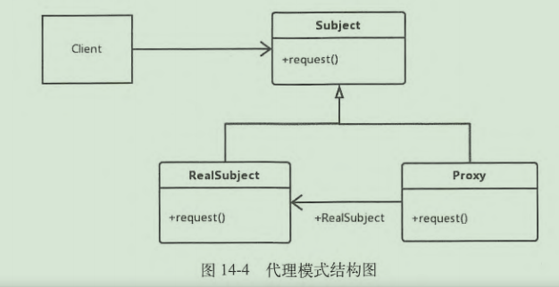

## 前言

> 前面几篇我们讲了aidl和binder的基本使用方法，当aidl为了实现不同进程间的通信功能的时候，使用了静态代理模式，  
> 本篇我们就来具体说说Java中最基本的静态代理和动态代理

## 代理模式

- 代理模式也叫委托模式，是结构型设计模式中的一种。   
  在现实生活中我们用到类似代理模式的场景有很多，比如代购、代理上网、打官司等。
- 定义   
  为其他对象提供一种代理以控制对这个对象的访问，我们称之为代理模式
- 在代理模式中有如下角色。   
  Subject：抽象主题类，声明真实主题与代理的共同接口方法。   
  RealSubject：真实主题类，定义了代理所表示的集体对象，客户端通过代理类间接调用真实主题类的方法
  Proxy：代理类，持有对真实主题类的引用，在其所实现的接口方法中调用真实主题类中相应的接口方法执行。   
  Client：客户端类。



## 准备

我们先创建一个抽象主题类IBuyFood和真实主题类XiaoMing

```java
public interface IBuyFood {

    public void buyBanana();

}
```

```java
public class XiaoMing implements IBuyFood {
    public static String TAG = "XiaoMing=======";

    @Override
    public void buyBanana() {
        Log.d(TAG, "买香蕉");
    }
}
```

## 静态代理

我们创建一个实现了IBuyFood接口的代理类，其内部持有IBuyFood的真实实例

```java
public class BuyFoodProxy implements IBuyFood {
    public static String TAG = "Proxy=======";
    IBuyFood iBuyFood;

    public BuyFoodProxy(IBuyFood iBuyFood) {
        this.iBuyFood = iBuyFood;
    }

    @Override
    public void buyBanana() {
        Log.d(TAG, "准备买香蕉....");
        iBuyFood.buyBanana();
        Log.d(TAG, "香蕉买完了....");
    }
}
```

接下来具体看下我们的代码是如何调用的：

```java
public class MainActivity extends AppCompatActivity {

    @Override
    protected void onCreate(Bundle savedInstanceState) {
        super.onCreate(savedInstanceState);
        setContentView(R.layout.activity_main);
        findViewById(R.id.btn_proxy_static).setOnClickListener(new View.OnClickListener() {
            @Override
            public void onClick(View v) {
                IBuyFood iBuyFood = new XiaoMing();
                BuyFoodProxy buyFoodProxy = new BuyFoodProxy(iBuyFood);
                buyFoodProxy.buyBanana();
            }
        });
    }
}
```

日志信息：

```cmd
2022-04-07 16:25:14.960 23163-23163/com.example.a05proxymodel D/Proxy=======: 准备买香蕉....
2022-04-07 16:25:14.960 23163-23163/com.example.a05proxymodel D/XiaoMing=======: 买香蕉
2022-04-07 16:25:14.960 23163-23163/com.example.a05proxymodel D/Proxy=======: 香蕉买完了....
```

通过日志信息我们可以发现，我们使用面向切面的思想，在不影响原来代码的基础上，分别在前面和后面加上了额外的操作，这其实也是代理模式的一种具体用途。

## 动态代理

上面我们所讲的静态代理，在代码运行前就已经存在了代理类的class文件；而动态代理则是在代码运行时通过发射来动态的生成代理类的对象，并确定到底来代理谁。  
也就是说我们在编码阶段并不知道要代理谁，到底代理谁我们将在代码运行时决定。  
Java提供了动态的代理接口InvocationHandler，我们需要实现该接口并重写invoke方法。  
我们创建一个动态代理类DynamicBuy：

```java
public class DynamicBuy implements InvocationHandler {
    public static String TAG = "DynamicBuy=======";
    Object object;

    public DynamicBuy(Object object) {
        this.object = object;
    }

    @Override
    public Object invoke(Object proxy, Method method, Object[] args) throws Throwable {
        if (method.getName().equals("buyBanana")) {
            Log.d(TAG, "准备买香蕉....");
        }
        Object result = method.invoke(object, args);
        if (method.getName().equals("buyBanana")) {
            Log.d(TAG, "香蕉买完了....");
        }
        return result;
    }
}
```

在DynamicBuy中我们声明了一个Object的引用，该引用会指向被代理类，然后我们再间接调用被代理类的具体方法。   
下面是具体调用实现：

```java
public class MainActivity extends AppCompatActivity {

    @Override
    protected void onCreate(Bundle savedInstanceState) {
        super.onCreate(savedInstanceState);
        setContentView(R.layout.activity_main);
        findViewById(R.id.btn_proxy_dynamic).setOnClickListener(new View.OnClickListener() {
            @Override
            public void onClick(View v) {
                IBuyFood iBuyFood = new XiaoMing();//其实我们并不需要知道XiaoMing这个实例类，他也可以是其他实现了IBuyFood接口的实例。
                DynamicBuy dynamicBuy = new DynamicBuy(iBuyFood);//创建动态代理
                ClassLoader classLoader = getClassLoader();//获取类加载器
                IBuyFood proxy = (IBuyFood) Proxy.newProxyInstance(classLoader, new Class[]{IBuyFood.class}, dynamicBuy);//创建动态代理类
                proxy.buyBanana();
            }
        });
    }
}
```

调用 Proxy.newProxyInstance来生成动态代理类，当我们调用proxy的buyBanana方法会调用dynamicBuy的invoke方法，然后我们再在里面调用真正的实现类。

> 本篇介绍静态代理和动态代理，通过静态代理让我们进一步体会到aidl帮我们创建类过程中所使用的设计模式；而关于动态代理模式，特别是当我们想要在app运行阶段Hook某些系统类的时候，
> 动态代理会是一种很不错的方式。